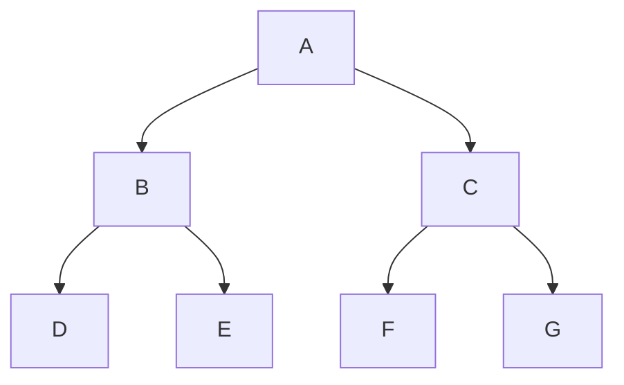
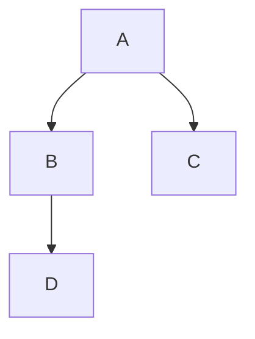

#### Divide-and-Conquer
- Solves a problem's instance by dividing into several smaller instances, solving each of them recursively

**Importance of Divide and Conquer Algorithm Design**:
- *Solving difficult problems*
- *Algorithm efficiency*
- *Parallelism*
- *Memory Access*

--- 
### Merge Sort 
- Combines two files ordered into one ordered file on the same given key

**Steps:**
Array: [29, 12, 14, 22, 27, 15, 17, 24]
1. **Divide array**
	-  [29, 12, 14, 22] - [27, 15,17,24]
2. **Sort each sub-array**
	- [12, 14, 22, 19] - [15, 17, 24, 27]
3. **Merge sub-arrays**
	- [12, 14, 15, 17, 19, 22, 24, 27]

---
### Quick Sort
- Developed by C.A.R. Hoare in 1962
- Partition Operation

**Steps:**
Array: [16, 23, 14, 28, 13, 11, 21, 26]
1. **Partition the array**
	- Pivot = 16
	- Smaller Values = [11, 14, 13]
	- Larger Values = [23, 28, 21, 26]
2. **Sort each sub-array**
	- Smaller Values = [11, 13, 14]
	- Larger Values = [21, 23, 26, 28]
3. **Merge sub-arrays**
	- [11,13,14,16,21,23,26,28]

---
### Binary Search
- used to locate an element in an ordered array
- starts by testing the data in the element at the middle of the array to determine if the target is in the first or second half of the list

---
### Binary Tree
- no node can be more than two subtrees

##### Binary Factor
- Height difference between the left subtree and right subtree
$$B=H_L-H_R$$

$$ B = 1-0 $$
$$B = 1$$
#### Binary Tree Traversal
- Requires that each node of the tree be processed once and only once in a predetermined sequence

##### Approaches to traversal sequence:

###### Depth-first traversal 
- proceeds along a path from the root through a *child to the most distant descendant of that first child* before processing a second child

**Pre-order Traversal** = Root -> Left -> Right
**In-order Traversal** = Left -> Root -> Right
**Post-order Traversal** = Left -> Right -> Root

[[Sample Problems]]
###### Breadth-first traversal 
- proceeds horizontally from the root *to all of its children, then to its children's children*

	