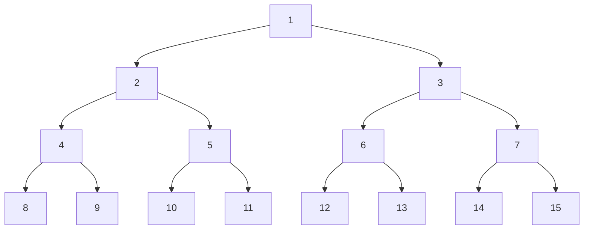
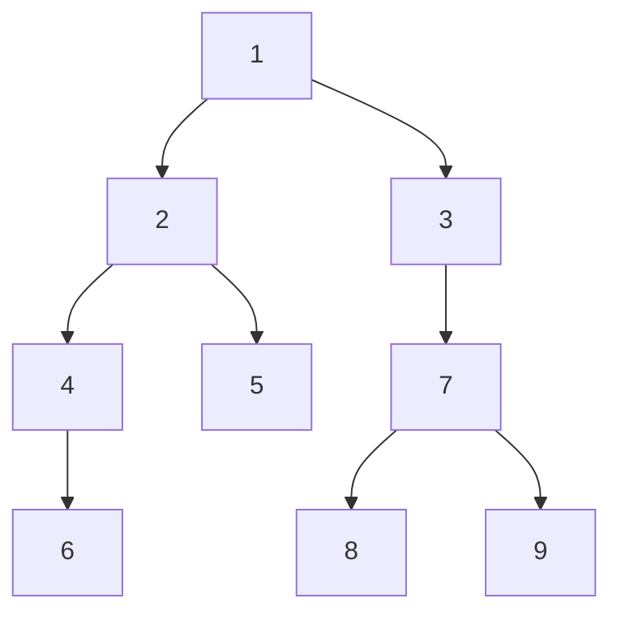
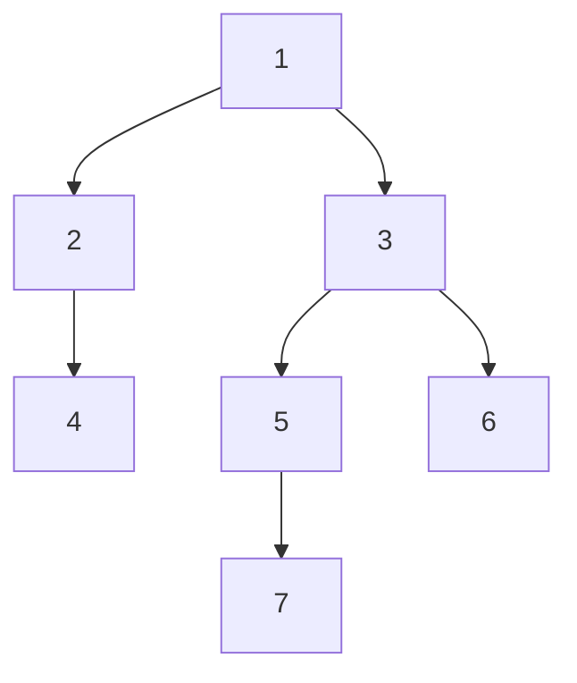

#### Binary Tree Traversal
##### 1.

**Pre-order Traversal (Root, Left, Right):**  
- *Answer*: 1, 2, 4, 8, 9, 5, 10, 11, 3, 6, 12, 13, 7, 14, 15
    
**In-order Traversal (Left, Root, Right):**  
- *Answer*: 8, 4, 9, 2, 10, 5, 11, 1, 12, 6, 13, 3, 14, 7, 15
    
**Post-order Traversal (Left, Right, Root):**  
- *Answer*: 8, 9, 4, 10, 11, 5, 2, 12, 13, 6, 14, 15, 7, 3, 1

##### 2.


**Pre-order Traversal (Root, Left, Right):**  
- *Answer*: 1, 2, 4, 6, 5, 3, 7, 8, 9
    
**In-order Traversal (Left, Root, Right):**  
- *Answer*: 6, 4, 2, 5, 1, 3, 8, 7, 9
    
**Post-order Traversal (Left, Right, Root):**  
- *Answer*: 6, 4, 5, 2, 8, 9, 7, 3, 1

##### 3.


**Pre-order Traversal (Root, Left, Right):**  
- *Answer*: 1, 2, 4, 3, 5, 7, 6
    
**In-order Traversal (Left, Root, Right):**  
- *Answer*: 4, 2, 1, 7, 5, 3, 6
    
**Post-order Traversal (Left, Right, Root):**  
- *Answer*: 4, 2, 7, 5, 6, 3, 1

--- 
#### Frequency Count
##### 1.
```python
x = 1 # --> 1
while (x <= n): # n - x + 2 = n - 1 + 2 = n + 1 (substitute x)
	x = x + 1   # n - x + 1 = n - 1 + 1 = n
				# total = 2n + 2
```
