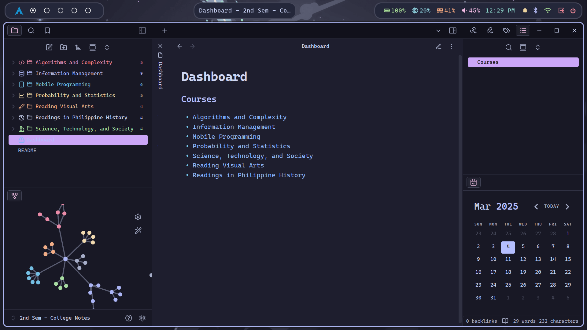

## Obsidian 2nd Semester College Notes


#### Courses
- Algorithms and Complexity
- Information Management
- Mobile Programming
- Probability and Statistics
- Science, Technology, and Society
- Reading Visual Arts
- Readings in Philippine History

#### Plugins
- Various Complements
- Calendar
- Iconize
- File Color
- File Explorer Note Count

#### Themes
- Obsidianite
- Catppuccin
- TokyoNight

--- 
#### Installation
1. Clone repository
```bash
git clone https://github.com/Augustus1417/2nd-Sem--College-Notes/tree/main
```
2. Open as Obsidian Vault

Or download as zip and extract then open as vault
